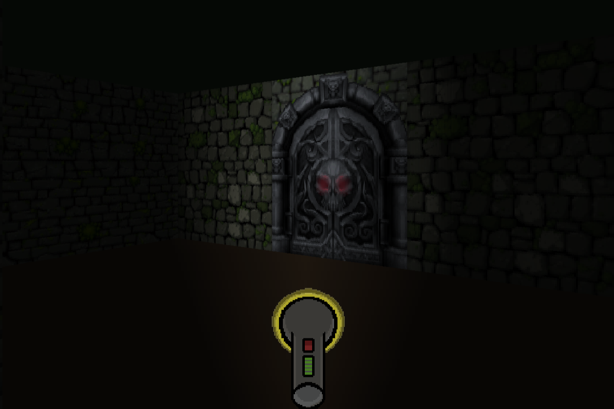

# 🎮 Out of Bounds



_A raycasted retro-style game project written entirely in **C**._
_The game was submitted as one of the mandatory projects apart of the 42 curriculum._

## 🎯 Overview

The goal of the game is to exit the floor through a special door on the map. Each floor contains threats which you need to avoid while having limited visibility as your only source of light isn't the most reliable.
A minimap is there to help you orientate around the world which can optionally be turned off.

We decided to include pixelated graphics due to the project constraints and limitations. However, these limitations helped us to creatively come up with a unique twist which we had not seen before in equivalent work.

## ✨ Features

- Gameplay that pushes the player forward
- Wall collisions and sliding
- Functional doors
- Animated sprites
- NPC sprites with simple logic
- Mouselook
- Level transitions
- Simple lighting
- Framerate limiting

## 📐 Technical Breakdown

| Component           | Description                                                                                      |
|---------------------|--------------------------------------------------------------------------------------------------|
| Raycasting          | Pre-requisite for world drawing. Gives us distance to walls, doors and sprites.                  |
| Renderer            | Objects in the game world are rendered vertical line by vertical line.                           |
| Input Handling      | Consistent input handling with lag compensation.                                                 |
| Game Hook           | Frame limiting, draw calls, movement and rotation handling.                                      |
| Resource Management | Mostly stack allocated for speed and ease of use. Heap allocation for storing more complex data. |
| Error Handling      | Verbose error and warning messaging useful in debugging.                                         |
| File Structure      | Organized based on core components.                                                              |

## 🎨 Art & Visuals

- Surfaces created with img2img generation from hand-drawn source images.
- Doors cropped from a free-to-use spritesheet.
- NPC texture made with image generation.
- Hand-drawn flashlight sprites.
- Lighting effect achieved by adjusting a shadow overlay on top of the game world.

## 🕹️ Controls

| Keybind                                | Description                                                                   |
|----------------------------------------|-------------------------------------------------------------------------------|
| W, A, S, D                             | Directional movement                                                          |
| Mouse or Arrow keys                    | View rotation                                                                 |
| E                                      | Door opening                                                                  |
| Spacebar or Left mouseclick            | Toggling the flashlight on or off                                             |
| M or Tab                               | Toggling the minimap on or off                                                |
| Ctrl + N                               | Skip the current level (exits when on last level)                             |
| U                                      | Unlocks mouse cursor from the window                                          |

## 🖥️ System Requirements

- ✅ **Linux** distributions running X11 or Wayland
- ❌ **MacOS**
- ❌ **Windows**

## 🔧 Dependencies

- Graphics Library: **GLFW**
- Build Systems: **Cmake**, **Make**
- Compiler: **gcc**

## 🚀 How to Run

```bash
# Clone the repository
git clone https://github.com/fpikkov/cub3D.git
cd cub3D

# Build with Make
make

# Run
./build/cub3d --launch

# Alternatively
./build/cub3d ./maps/<your_chosen_map>
```

## 🪙 Credits

- [Anselmi Veikko](https://github.com/AnselmiVeikko)
- [Fred Pikkov](https://github.com/fpikkov)
